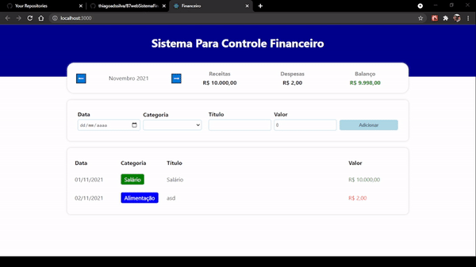
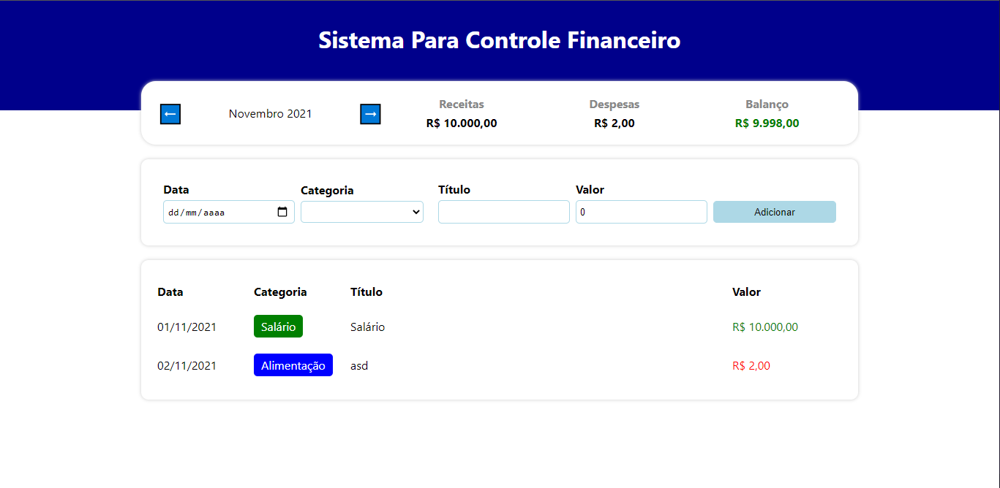

# B7webSistemaFinanceiro

Sistema de Finanças Pessoais em React (com Typescript) - Projeto 2 - Desafio 5em5 (React)

### Dentro do <b>README</b> da pasta do projeto está tudo que foi ou está sendo usando:

https://github.com/thiagoadssilva/B7webSistemaFinanceiro/blob/main/expense-tracker/README.md

## Projeto Publicado: financeb7web.tfcoder.com

## Um pequeno video:

## Algumas imgens :

